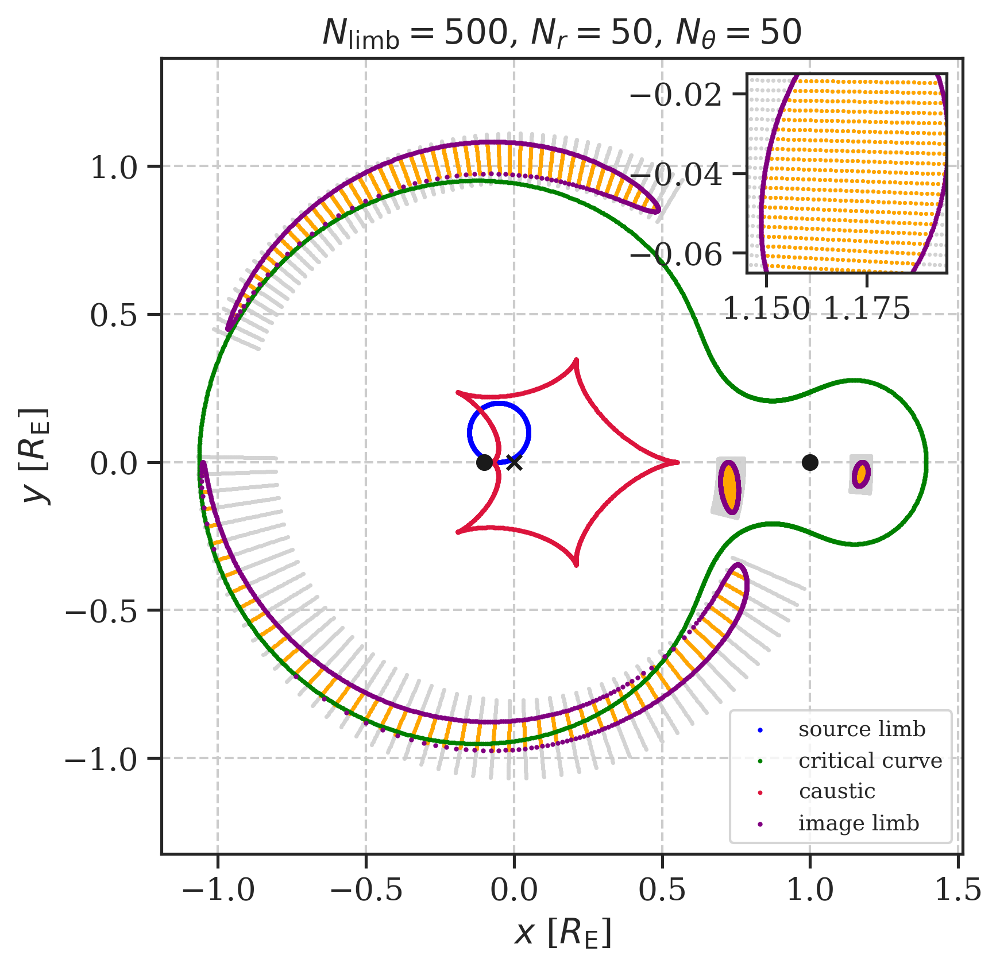
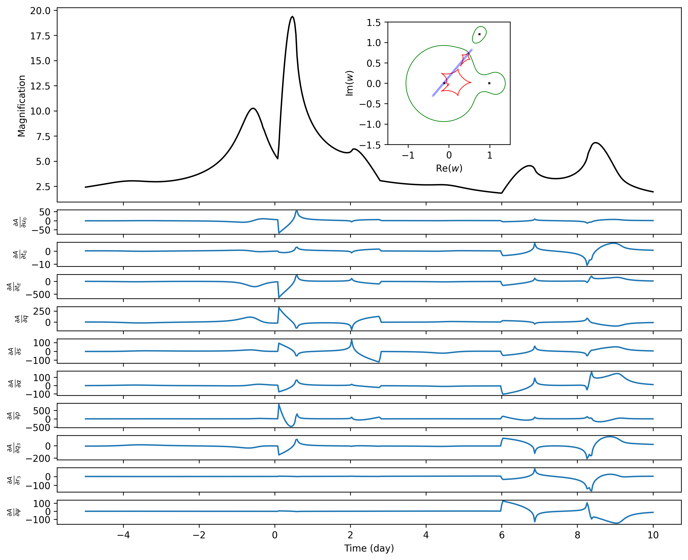

<p align="center">
  
  <br>
</p>

# microjax

[](https://www.python.org/)
[](https://github.com/google/jax)


**microJAX** is a **fully‑differentiable**, **GPU‑accelerated** software for modelling gravitational microlensing light curves produced by **binary**, and **triple** lens systems, using the **image-centered ray shooting (ICRS)** method [(e.g., Bennett 2010)](https://ui.adsabs.harvard.edu/abs/2010ApJ...716.1408B/abstract). Written entirely in [JAX](https://github.com/google/jax), it delivers millisecond‑level evaluations of extended-source magnifications *and* exact gradients for every model parameter through the use of [automatic differentiation](https://jax.readthedocs.io/en/latest/notebooks/autodiff_cookbook.html), enabling gradient‑based Bayesian inference workflows such as Hamiltonian Monte Carlo (HMC) and variational inference. 


---

## ✨ Key Features

| Category                | Description                                                                                                              |
| ----------------------- | ------------------------------------------------------------------------------------------------------------------------ |
| **Lens Systems**        | Supports point-source and finite-source magnification calculations for binary and triple lens systems                    |
| **Extended Sources**    | Models uniform and limb-darkened source profiles                                                     |
| **Computational Core**  | Implements the Image-Centered Ray Shooting (ICRS) algorithm in JAX, fully optimized for GPU acceleration                 |
| **Root-Finding Engine** | Uses a differentiable Ehrlich-Aberth method for complex polynomial roots with [implicit gradients](http://implicit-layers-tutorial.org/implicit_functions/) for stable optimization |
| **Bayesian Inference**  | Provides a ready-to-use likelihood function compatible with NumPyro's HMC and variational inference frameworks           |

## 📦 Installation

```bash
# clone the repository
git clone https://github.com/ShotaMiyazaki94/microjax.git
cd microjax

# editable install with all extras (GPU/TPU support depends on your JAX wheel)
pip install -e .[dev]
```

> **Note** : microJAX is in active development and not yet on PyPI.  API changes may still occur before the first stable (v1.0) release.

---

## Example output

Refer to the [example](example/) directory for code that creates these plots.

| Visualization of the ICRS method (binary-lens) | Triple-lens magnification and its gradients |
| --------------------------------------- | --------------------------------------------- |
|  |  |

## 📚 References
* [Miyazaki & Kawahara (in prep.)](): `microjax` paper (expected within 2025!)
* [Bennett (2010)](https://ui.adsabs.harvard.edu/abs/2010ApJ...716.1408B/abstract): Image-centred ray shooting (ICRS) method   
* [Cassan (2017)](https://academic.oup.com/mnras/article/468/4/3993/3103057?login=true): Quadrupole & hexadecapole approximations
* [Sugiyama (2022)](https://ui.adsabs.harvard.edu/abs/2022ApJ...937...63S/abstract): Fast FFT-based magnification evaluation with a single-lens extended source model

## 🤝 Contributing

Pull requests are welcome!  Please see [`CONTRIBUTING.md`](CONTRIBUTING.md) for coding style, test suite, and CI guidelines.  Bug reports can be filed via GitHub Issues.

## 📜 License

This project is licensed under the [MIT License](LICENSE).  If you use `microJAX` in academic work, please cite the upcoming Miyazaki et al. (2025) methods paper.

---