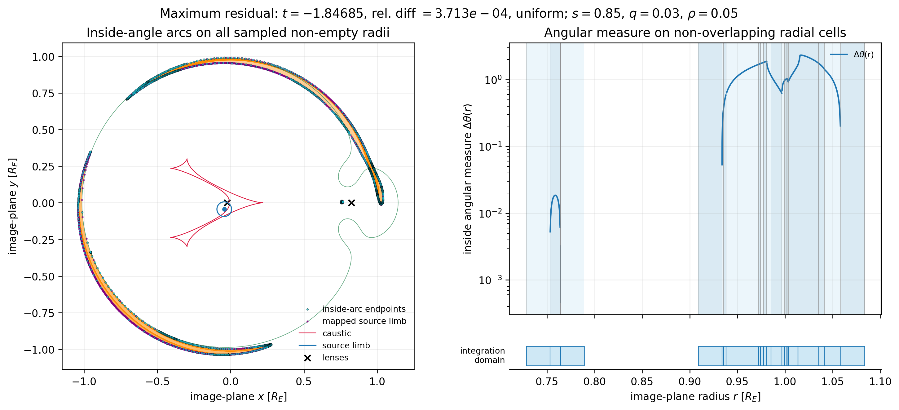
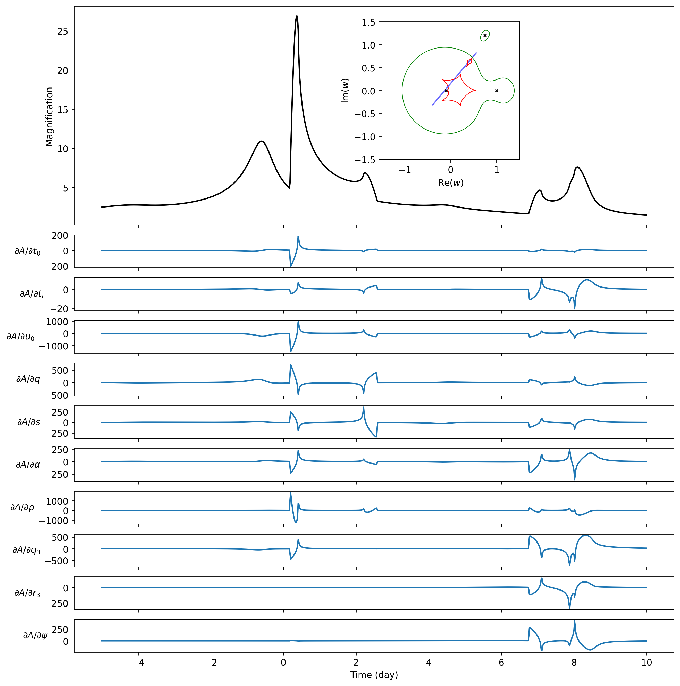

<p align="center">
  
</p>

# microJAX

**Differentiable microlensing models for CPUs and GPUs in JAX.**

[](https://www.python.org/)
[](https://github.com/jax-ml/jax)
[](https://pypi.org/project/microjaxx/)
[](https://doi.org/10.5281/zenodo.17247892)
[](#accuracy-and-limitations)
[](LICENSE)

microJAX models gravitational microlensing by single, binary, and triple lens
systems. For an extended source, it locates the lensed images of the source
edge and integrates the enclosed image brightness. The implementation works
with JAX transformations such as `jit`, `vmap`, and forward-mode automatic
differentiation. The package also provides point-source magnification, caustic
curves, fast finite-source approximations, and trajectory utilities.

The PyPI distribution is named **`microjaxx`**; the Python package is imported
as **`microjax`**.

## Release lineage

microJAX has two important version lines:

- **`v0.1.1` is the archived paper version.** Use this tag when reproducing
  the implementation associated with Miyazaki & Kawahara (2025).
- **The `0.2` series is the redesigned implementation.** It introduces the
  current finite-source calculation for binary and triple lenses, linear limb
  darkening, improved treatment of small isolated images, and a reorganized
  public API.

Results should record the exact microJAX version or Git commit, the JAX and
JAXLIB versions, the execution platform, and the numerical configuration.
See [CHANGELOG.md](CHANGELOG.md) for the user-visible differences.

## Installation

Install the latest published release from PyPI:

```bash
python -m pip install microjaxx
```

Install the paper version explicitly:

```bash
python -m pip install "microjaxx==0.1.1"
```

Install the current source tree for development or for testing the upcoming
`0.2` release:

```bash
git clone https://github.com/ShotaMiyazaki94/microjax.git
cd microjax
python -m pip install -e ".[dev]"
```

JAX accelerator wheels are platform-specific. Install the appropriate CPU,
CUDA, or ROCm build by following the
[official JAX installation guide](https://docs.jax.dev/en/latest/installation.html).
Double precision is strongly recommended for microlensing calculations:

```python
import jax

jax.config.update("jax_enable_x64", True)
```

Set this option before creating arrays or compiling microJAX functions.

## Quickstart

The primary `0.2` extended-source API consists of `mag_binary`, `mag_triple`,
and their configuration objects. `n_limb` is the number of points used to
trace the lensed image of the source circumference. The default value, 500, is
recommended for normal use. Advanced users can tune `source_tile_size` and
`radial_chunk_size` for their accelerator and workload.

```python
import jax
import jax.numpy as jnp

jax.config.update("jax_enable_x64", True)

from microjax.inverse_ray import BinaryMagConfig, mag_binary
from microjax.point_source import mag_point_source

# Binary lens and circular source
s = 1.0
q = 0.01
rho = 0.02

# Rectilinear source trajectory
t0, tE, u0 = 0.0, 30.0, 0.0
alpha = jnp.deg2rad(10.0)
t = t0 + jnp.linspace(-tE, tE, 1000)
tau = (t - t0) / tE
w = (
    -u0 * jnp.sin(alpha)
    + tau * jnp.cos(alpha)
    + 1j * (u0 * jnp.cos(alpha) + tau * jnp.sin(alpha))
)

config = BinaryMagConfig(n_limb=500)

# Uniform finite source. Set u1 > 0 for linear limb darkening.
mu_finite = mag_binary(w, rho, s=s, q=q, u1=0.0, config=config)
mu_point = mag_point_source(w, nlenses=2, s=s, q=q)
```

The default scheduler targets GPU light-curve workloads while limiting peak
memory. `source_tile_size` controls the number of source positions in each
outer vectorized batch, and `radial_chunk_size` controls the inner batch of
radial integration regions. Setting `radial_chunk_size=64` evaluates the full
fixed-capacity region buffer together. On the measured A100 binary workload it
reduced execution time and raised the 100-position-tile primal peak from about
160 MiB to 256 MiB. Both scheduler sizes must be positive integers. These
settings change static JAX shapes, so each distinct configuration is compiled
separately:

The A100-tuned defaults are `source_tile_size=100` for both lens types,
`radial_chunk_size=64` for binary lenses, and `radial_chunk_size=8` for triple
lenses.

```python
config = BinaryMagConfig(
    n_limb=500,
    source_tile_size=32,
    radial_chunk_size=16,
)
```

Binary lenses also provide a differentiable CPU backend. Select it with
`backend="cpu"`; `backend="cpu-one-shot"` is a compatibility alias, while
`backend="cpu-adaptive"` retains the older research scheduler. Use
`return_info=True` when validating a parameter region:

```python
cpu = mag_binary(
    w,
    rho,
    s=s,
    q=q,
    u1=0.0,
    backend="cpu",
    return_info=True,
)
mu_cpu = cpu.magnification
valid = cpu.status == 0
```

With `return_info=False`, structurally invalid CPU samples become `NaN`.
`status == 0` means that no known structural failure was detected; it is not
an accuracy certificate. The [CPU backend guide](docs/cpu_backend.html)
documents the execution contract, diagnostics, validation, and forward-mode
automatic differentiation.

Triple-lens finite-source magnification uses the same source convention:

```python
from microjax.inverse_ray import TripleMagConfig, mag_triple

mu_triple = mag_triple(
    w,
    rho,
    s=1.1,
    q=0.1,
    q3=0.01,
    r3=0.8,
    psi=0.7,
    u1=0.5,
    config=TripleMagConfig(n_limb=500),
)
```

For a circular finite source magnified by one point lens, use the dedicated
FSPL implementation:

```python
from microjax.fspl import fspl_disk, fspl_ld1

u = jnp.linspace(0.0, 1.0, 1000)
mu_fspl = fspl_disk().A(u, rho=0.01)
mu_fspl_ld = fspl_ld1(a1=0.5).A(u, rho=0.01)
```

The first call includes JAX compilation time. For timing, run one warm-up call,
block until the result is ready, and then time repeated evaluations.

## Differentiation

The current solver can be differentiated with JAX. For example:

```python
def light_curve(q):
    return mag_binary(w, rho, s=s, q=q)

dmu_dq = jax.jacfwd(light_curve)(q)
```

Automatic differentiation does not by itself certify numerical accuracy or
smoothness at every parameter value. The number or arrangement of lensed
images can change at caustic crossings, and the code switches between a fast
approximation and the full finite-source calculation when needed. These
changes can produce non-smooth numerical behaviour. Validate both
magnifications and gradients over the parameter region used for inference.

## How the current finite-source solver works

For each source position, microJAX first tries a fast finite-source
approximation. Near a caustic, where that approximation may be inaccurate, it
uses the following full calculation:

1. Sample the circumference of the circular source and calculate its lensed
   image positions.
2. Connect samples that belong to the same continuous image of the source
   circumference.
3. Determine the range of image-plane radius occupied by those images and
   combine overlapping ranges.
4. Divide each range wherever the number or arrangement of image-boundary
   crossings may change.
5. At selected radii, solve for the angles where a circle in the image plane
   crosses the lensed source boundary.
6. Integrate the brightness between those crossing angles, and then integrate
   the result over radius to obtain the magnification.

## Examples and validation

<table>
  <tr>
    <th>Binary-lens comparison with VBBL</th>
    <th>Triple-lens magnification and Jacobian</th>
  </tr>
  <tr>
    <td>
      <p align="center"><em>Light curve and residuals</em></p>
      
      <p align="center"><em>Image-plane check at the maximum-residual sample</em></p>
      
    </td>
    <td>
      
    </td>
  </tr>
</table>

Reproducible scripts and their numerical settings are grouped by execution
backend under [example/](example/):

- [GPU jacobian-binary](example/gpu/jacobian-binary/) evaluates uniform and
  limb-darkened binary-lens light curves and reports their Jacobians;
- [CPU jacobian-binary](example/cpu/jacobian-binary/) preserves those binary
  trajectories with the CPU ICRS backend and forward-mode AD;
- [GPU jacobian-triple](example/gpu/jacobian-triple/) evaluates uniform and
  limb-darkened triple-lens light curves and reports their forward Jacobians;
- [GPU compare-binary-vbbl](example/gpu/compare-binary-vbbl/) compares the binary
  solver with VBBinaryLensing and visualizes the maximum-residual sample;
- [GPU compare-triple-vbml](example/gpu/compare-triple-vbml/) compares the triple
  solver with VBMicrolensing for uniform and limb-darkened sources.

Benchmark numbers are hardware-, JAX-, configuration-, and trajectory-specific.
Treat the committed results as reproducibility records, not universal speed or
accuracy guarantees.

## Accuracy and limitations

microJAX is research software under active development. Keep the following in
mind when using `mag_binary` and `mag_triple`:

- each source position is evaluated either with a fast approximation or with
  the full finite-source calculation;
- the accelerator full calculation uses fixed work; the default binary CPU
  backend likewise selects one fixed Cartesian or polar calculation from one
  source-limb trace and reports detected structural failures;
- the returned finite value is a numerical estimate. The public API does not
  provide a guaranteed error bound;
- if microJAX cannot construct a valid image boundary or integration region,
  or encounters a non-finite intermediate value, it returns `NaN`;
- increasing `n_limb` samples the source circumference more finely, but does
  not directly increase the number of radial integration points;
- scheduler settings are performance and memory controls, not accuracy
  controls, and their best values depend on the accelerator and trajectory;
- uniform sources and the linear limb-darkening law parameterized by `u1` are
  supported by `mag_binary` and `mag_triple`;
- accelerator workloads remain the target for maximum throughput; the binary
  CPU backend is separately optimized and can be competitive with VBBL on
  caustic-heavy batches, though smooth trajectories remain slower.

## Documentation

- [Hosted documentation](https://shotamiyazaki94.github.io/microjax/)
- [CPU binary-lens backend guide](docs/cpu_backend.html)
- [Contributing guide](CONTRIBUTING.md)
- [Changelog](CHANGELOG.md)

The rendered Sphinx HTML bundle is also committed under `docs/`.

## Citing microJAX

If you use microJAX in academic work, cite the methods paper and the archived
software version actually used. The methods paper corresponds to the `v0.1.1`
line; work using the redesigned `0.2` solver should additionally report the
exact `0.2.x` release or Git commit.

- Miyazaki, S., & Kawahara, H. 2025, ApJ, 994, 144,
  [doi:10.3847/1538-4357/ae1005](https://doi.org/10.3847/1538-4357/ae1005)
- microJAX software archive,
  [doi:10.5281/zenodo.17247892](https://doi.org/10.5281/zenodo.17247892)

```bibtex
@ARTICLE{2025ApJ...994..144M,
  author = {{Miyazaki}, Shota and {Kawahara}, Hajime},
  title = {microJAX: A Differentiable Framework for Microlensing Modeling
           with GPU-accelerated Image-centered Ray Shooting},
  journal = {The Astrophysical Journal},
  year = {2025},
  volume = {994},
  number = {2},
  pages = {144},
  doi = {10.3847/1538-4357/ae1005}
}

@software{microjax_zenodo_17247892,
  author = {Miyazaki, Shota},
  title = {microJAX},
  year = {2025},
  publisher = {Zenodo},
  doi = {10.5281/zenodo.17247892},
  url = {https://doi.org/10.5281/zenodo.17247892}
}
```

## Contributing and tests

Bug reports and pull requests are welcome. See [CONTRIBUTING.md](CONTRIBUTING.md)
before changing the solver or its numerical defaults.

For the CPU development loop, run the compact smoke suite:

```bash
pytest -c pytest-cpu-fast.ini -q
```

This covers the low-level CPU kernels plus representative public uniform,
limb-darkening, one-shot, fail-closed, polar, and forward-AD paths. It runs in
about 20 seconds on a warm development machine. Run the standard CPU suite with:

```bash
pytest -q
```

The standard CPU suite excludes the explicitly slow numerical and AD
regressions by default. Include those regressions when needed with:

```bash
pytest -m "not gpu" -q
```

GPU tests have a separate configuration and are opt-in:

```bash
pytest -c pytest-gpu.ini -q
```

## License

microJAX is distributed under the [MIT License](LICENSE). Third-party code and
its attribution are listed in [third_party/README.md](third_party/README.md).
