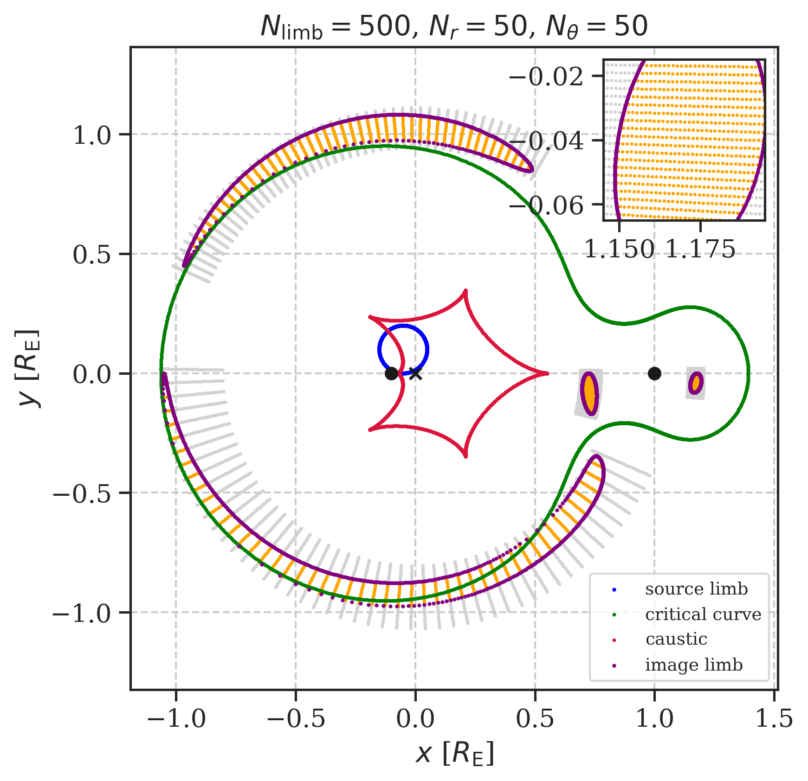
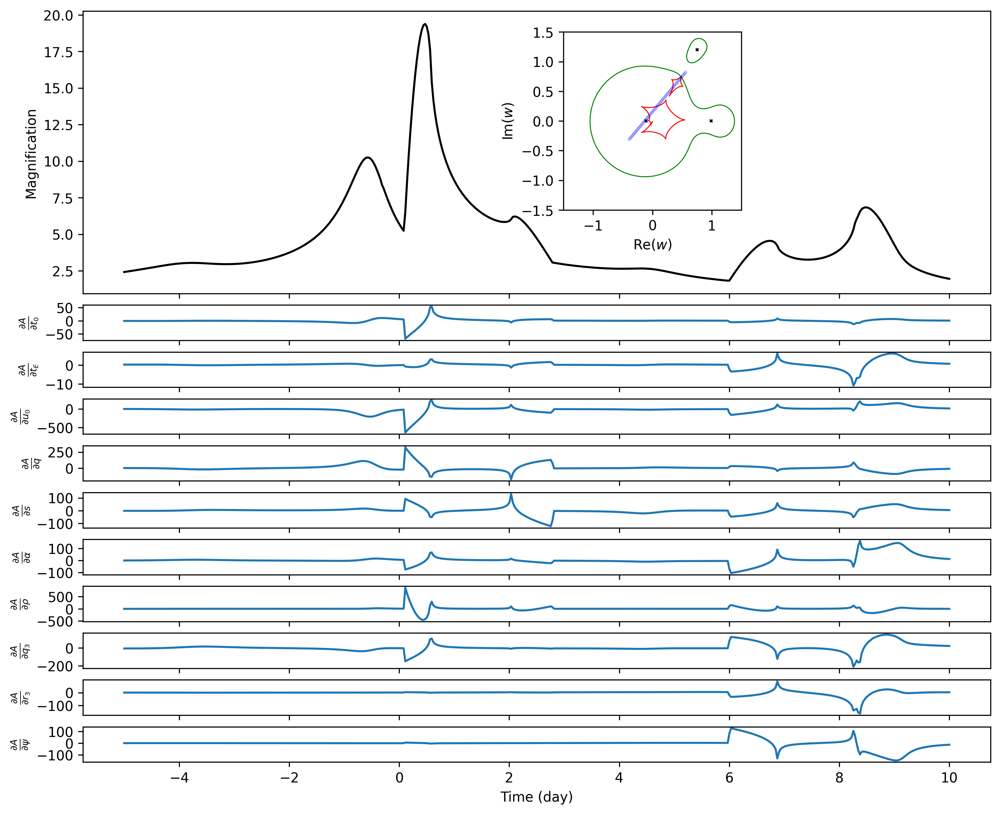

<p align="center">
  
</p>

**microJAX is a GPU-accelerated, differentiable microlensing modeling library written in JAX.**

# microJAX

[](https://www.python.org/)
[](https://github.com/google/jax)
[](https://pypi.org/project/microjaxx/)
[](https://doi.org/10.5281/zenodo.17247892)


**microJAX** is a **fully‑differentiable**, **GPU‑accelerated** software for modelling gravitational microlensing light curves produced by **binary**, and **triple** lens systems, using the **image-centered ray shooting (ICRS)** method [(e.g., Bennett 2010)](https://ui.adsabs.harvard.edu/abs/2010ApJ...716.1408B/abstract). Written entirely in [JAX](https://github.com/google/jax), it delivers millisecond‑level evaluations of extended-source magnifications *and* exact gradients for every model parameter through the use of [automatic differentiation](https://jax.readthedocs.io/en/latest/notebooks/autodiff_cookbook.html), enabling gradient‑based Bayesian inference workflows such as Hamiltonian Monte Carlo (HMC) and variational inference.

This software is under active development and not yet feature complete.

---

## Documentation

For detailed guides, tutorials, and the API reference, visit the hosted [microJAX documentation](https://shotamiyazaki94.github.io/microjax/). The rendered HTML bundle also lives in `docs/` if you prefer browsing locally.

---

## 📦 Installation

From PyPI:

```bash
pip install microjaxx
```

Notes:

- PyPI package name: `microjaxx`
- Python import name: `microjax`

```python
import microjax
```

Development install (from source, recommended):

```bash
# clone the repository
git clone https://github.com/ShotaMiyazaki94/microjax.git
cd microjax
pip install -e ".[dev]"
```

GPU support: JAX/JAXLIB with CUDA/ROCm depends on your environment. Please follow the official JAX installation guide to install the appropriate `jaxlib` for your accelerator:

- JAX installation (CPU/GPU): https://jax.readthedocs.io/en/latest/installation.html

---

## 🚀 Quickstart

Compute an extended-source binary-lens magnification light curve using the image-centered ray shooting (ICRS) method:

Note: `mag_binary` also works on CPU but is very slow.

```python
import jax
import jax.numpy as jnp
from microjax.inverse_ray.lightcurve import mag_binary
jax.config.update("jax_enable_x64", True)

# Binary-lens parameters
s, q = 1.0, 0.01            # separation and mass ratio (m2/m1)
rho = 0.02                  # source radius (Einstein units)
tE, u0 = 30.0, 0.0          # Einstein time [days], impact parameter
alpha = jnp.deg2rad(10.0)  # trajectory angle
t0 = 0.0

# Source trajectory
N_points = 1000
t = t0 + jnp.linspace(-tE, tE, N_points)
tau = (t - t0)/tE
y1 = -u0*jnp.sin(alpha) + tau*jnp.cos(alpha)
y2 =  u0*jnp.cos(alpha) + tau*jnp.sin(alpha)
w_points = jnp.array(y1 + y2 * 1j, dtype=complex)

# Extended-source magnification (binary lens)
mu = mag_binary(w_points, rho, s=s, q=q)
```

For point-source magnification, use:

Note: `mag_point_source` runs on CPU (and GPU), so it works without a GPU.

```python
from microjax.point_source import mag_point_source
mu_point = mag_point_source(w_points, nlenses=2, s=s, q=q)
```

---

## Example output

| Visualization of the ICRS method (binary-lens) | Triple-lens magnification and its gradients | Compare with VBBL (uniform source, binary-lens) |
| --- | --- | --- |
|  |  |  |

Refer to the [example](example/) directory for code that creates these plots.

Note: Finite-source calculation with microJAX is extremely slow without a GPU. So, the latter two examples are significantly slower on a CPU.

---

## 📝 Citing microJAX

If you use microJAX in academic work, please cite the methods paper and, for versioned software DOIs, the Zenodo archive:

- Miyazaki, S., & Kawahara, H. 2025, ApJ, 994, 144, [doi:10.3847/1538-4357/ae1005](https://doi.org/10.3847/1538-4357/ae1005)
- microJAX software archive (Zenodo): [doi:10.5281/zenodo.17247892](https://doi.org/10.5281/zenodo.17247892)

BibTeX:

```bibtex
@ARTICLE{2025ApJ...994..144M,
       author = {{Miyazaki}, Shota and {Kawahara}, Hajime},
        title = {microJAX: A Differentiable Framework for Microlensing Modeling with GPU-accelerated Image-centered Ray Shooting},
      journal = {\apj},
         year = 2025,
        month = dec,
       volume = {994},
       number = {2},
          eid = {144},
        pages = {144},
          doi = {10.3847/1538-4357/ae1005},
archivePrefix = {arXiv},
       eprint = {2510.02639},
 primaryClass = {astro-ph.EP},
       adsurl = {https://ui.adsabs.harvard.edu/abs/2025ApJ...994..144M},
      adsnote = {Provided by the SAO/NASA Astrophysics Data System}
}

@software{microjax_zenodo_17247892,
  author = {Miyazaki, Shota},
  title = {microJAX},
  year = {2025},
  publisher = {Zenodo},
  doi = {10.5281/zenodo.17247892},
  url = {https://doi.org/10.5281/zenodo.17247892}
}
```

---

## ⚠️ Known Limitations

- Finite-source magnification trades memory/runtime for accuracy through resolution parameters; tune these settings to match your GPU's available memory and throughput.
- For numerical stability and agreement across libraries, enable 64-bit precision in JAX (`jax_enable_x64=True`).
- Triple-lens hexadecapole/ghost-image test is not yet implemented: triple-lens calculations fall back to full contour integration everywhere, which can be substantially slower.
- GPU tests are opt-in; run them explicitly with `pytest -m gpu`. If JAX cannot see a CUDA GPU, those tests are skipped.

## 📚 References
* [Miyazaki & Kawahara (2025)](https://ui.adsabs.harvard.edu/abs/2025ApJ...994..144M/abstract): `microjax` paper 
* [Bennett (2010)](https://ui.adsabs.harvard.edu/abs/2010ApJ...716.1408B/abstract): Image-centred ray shooting (ICRS) method   
* [Cassan (2017)](https://academic.oup.com/mnras/article/468/4/3993/3103057?login=true): Hexadecapole approximations
* [Sugiyama (2022)](https://ui.adsabs.harvard.edu/abs/2022ApJ...937...63S/abstract): Fast FFT-based magnification evaluation with a single-lens extended source model

## 🤝 Contributing

Pull requests are welcome!  Please see [`CONTRIBUTING.md`](CONTRIBUTING.md) for coding style, test suite, and CI guidelines.  Bug reports can be filed via GitHub Issues.

### Running Tests

CPU-only tests:

```
pytest -q
```

GPU-only tests are opt-in and skipped by default. To run them on a CUDA-capable machine:

```
# optionally: export JAX_PLATFORMS=cuda
pytest -m gpu -q
```

These tests require JAX to detect a CUDA device. If not available, they are skipped. No additional environment flag is required beyond the `-m gpu` marker.

## 📜 License

This project is licensed under the [MIT License](LICENSE).  Third-party components bundled in the tree and their respective licenses are listed in `third_party/README.md`.

---
