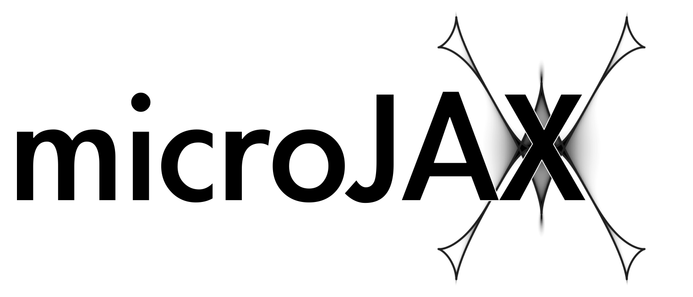

<p align="center">
  
</p>

# microJAX

**Differentiable microlensing models for CPUs and GPUs in JAX.**

[](https://www.python.org/)
[](https://github.com/jax-ml/jax)
[](https://pypi.org/project/microjaxx/)
[](https://doi.org/10.5281/zenodo.17247892)
[](LICENSE)

microJAX models point and finite sources in single-, binary-, and triple-lens
microlensing systems. It provides an accelerator-oriented boundary integrator,
a separate binary-lens CPU backend, forward-mode automatic differentiation,
caustic calculations, and trajectory utilities.

## Installation

```bash
python -m pip install microjaxx
```

The distribution is named `microjaxx`; import it as `microjax`. Install the JAX
build appropriate for your platform using the
[official JAX installation guide](https://docs.jax.dev/en/latest/installation.html).

## Quick start

Enable double precision before creating arrays or compiling functions:

```python
import jax
import jax.numpy as jnp

jax.config.update("jax_enable_x64", True)

from microjax.inverse_ray import mag_binary

w = jnp.asarray([0.10 + 0.20j, 0.60 - 0.20j])
rho, s, q = 0.01, 1.0, 0.3

mu = mag_binary(w, rho, s=s, q=q, backend="cpu")
```

The first call includes JAX compilation. The CPU backend is selected explicitly
and is currently available for finite-source binary lenses.

## Documentation

- [User guides and API reference](https://shotamiyazaki94.github.io/microjax/)
- [CPU binary-lens backend](https://shotamiyazaki94.github.io/microjax/cpu_backend.html)
- [Solver caveats](https://shotamiyazaki94.github.io/microjax/caveats.html)

Runnable workflows are grouped under [`example/cpu/`](example/cpu/) and
[`example/gpu/`](example/gpu/).

## Scientific use

Finite-source results are numerical estimates without guaranteed error bounds,
and rejected configurations may return `NaN`. Validate values and derivatives
over the parameter region used in an analysis. See the
[solver caveats](https://shotamiyazaki94.github.io/microjax/caveats.html) for
the microJAX-specific numerical contract.

## Citation

If you use microJAX, cite Miyazaki & Kawahara (2025), ApJ, 994, 144
([doi:10.3847/1538-4357/ae1005](https://doi.org/10.3847/1538-4357/ae1005))
and the archived software
([doi:10.5281/zenodo.17247892](https://doi.org/10.5281/zenodo.17247892)).
The methods paper describes the archived `v0.1.1` solver; report the exact
microJAX version used. See the
[citation guide](https://shotamiyazaki94.github.io/microjax/citing.html) for
BibTeX and reproducibility metadata.

## Development

See [CONTRIBUTING.md](CONTRIBUTING.md) for source installation, test profiles,
and contribution guidelines.

## License

microJAX is distributed under the [MIT License](LICENSE). Third-party code and
attribution are listed in [third_party/README.md](third_party/README.md).
