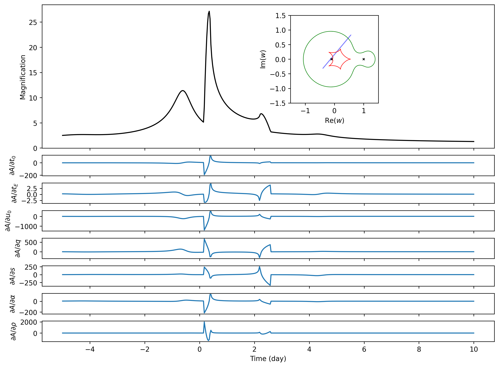
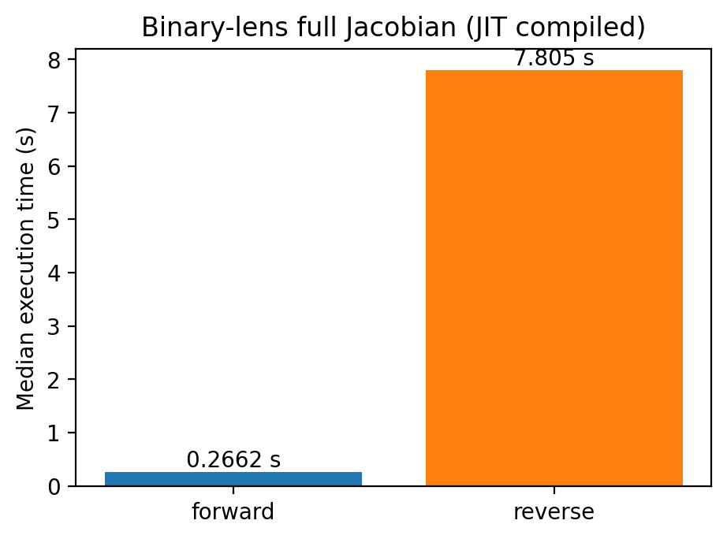

Binary-lens Jacobian Example
============================

This directory is the binary-lens counterpart of
[`example/triple-lens-jacobian`](../triple-lens-jacobian). It uses the new
retry-free [`microjax.inverse_ray.lightcurve.mag_binary`](../../src/microjax/inverse_ray/lightcurve.py)
implementation to compute the uniform-source magnification and its Jacobian
with respect to `t0, tE, u0, q, s, alpha, rho` using `jax.jacfwd` and
memory-bounded `jax.vjp`. It does not use the legacy dense `mag_uniform`
backend or the multi-stage `mag_binary_safe` scheduler.

The default path measures the function value and forward Jacobian after JIT
compilation. Because the model has seven inputs and hundreds of outputs,
forward mode is the production path. Pass `--with-reverse` only for the
diagnostic forward/reverse comparison; `--reverse-chunk` then controls its
memory/performance trade-off.

The companion `grads_limb_dark_binary.py` runs the same seven-parameter
Jacobian for a linearly limb-darkened source. Its coefficient is fixed with
`--u1` (default `0.5`): `u1` is a static kernel-selection argument in the
public `mag_binary` API and is therefore not included as an eighth derivative.
The limb-darkened boundary pass uses the profile-specific G15/K31 fixed-1
rule and remains retry-free.

Run
---

The default uses the same 500-point trajectory and `Nlimb=500` as the
triple-lens example. A CUDA-enabled JAX installation is strongly recommended:

```console
XLA_PYTHON_CLIENT_MEM_FRACTION=0.95 \
  python example/binary-lens-jacobian/grads_uniform_binary.py --no-plot
```

For the limb-darkened version:

```console
XLA_PYTHON_CLIENT_MEM_FRACTION=0.95 \
  python example/binary-lens-jacobian/grads_limb_dark_binary.py \
  --u1 0.5 --no-plot
```

Its products are written to `limb_dark_outputs/`, so the bundled uniform
products are not overwritten. When `--with-reverse` is requested, the
limb-darkened script uses a smaller default `--reverse-chunk 8` because its
nested profile quadrature is more memory intensive.

The measured reverse run uses about 21.4 GB. On a smaller GPU, reduce
`--reverse-chunk` to lower peak memory. Source batching inside `mag_binary`
is an internal GPU scheduler detail and is not exposed as a CLI option.

To run a small CPU-friendly benchmark and generate both plots:

```console
python example/binary-lens-jacobian/grads_uniform_binary.py --quick
```

The corresponding limb-darkened CPU smoke run is:

```console
python example/binary-lens-jacobian/grads_limb_dark_binary.py --quick
```

The first call of each AD mode includes tracing and JIT compilation. The
reported comparison uses the median of three later, synchronised executions;
change this with `--repeats`.

A100 GPU result
---------------

The bundled products were generated with JAX 0.10.2 on an NVIDIA
A100-PCIE-40GB. Both kernels use the retry-free G15/K31 fixed-1 radial rule
with 500 time points and `Nlimb=500`:

| computation | compile + first execution | compiled median (3 runs) |
| --- | ---: | ---: |
| uniform magnification | 11.199 s | 0.108 s |
| uniform forward Jacobian | 20.433 s | 0.151 s |

| limb-darkened magnification (`u1=0.5`) | 11.711 s | 0.114 s |
| limb-darkened forward Jacobian | 21.833 s | 0.389 s |

All magnifications and forward derivatives were finite. Reverse mode remains
available only through the explicit `--with-reverse` diagnostic.

For comparison, the retained `mag_binary_safe` scheduler previously took
1.572 s for magnification, 2.045 s for the forward Jacobian, and 62.317 s for
the reverse Jacobian on the same setup. The fixed-1 graph is substantially
smaller and faster. It is a best-effort path: radial-tolerance warnings retain
their one-pass value, while structural failures remain non-finite; use
`mag_binary_safe` for strict tolerance enforcement and bounded rescue.

| Magnification and forward Jacobian | Compiled AD runtime |
| --- | --- |
|  |  |

Outputs
-------

- `magnification.csv`: time and magnification columns.
- `jacobian_forward.npy`: forward-mode Jacobian (`n_time x 7`).
- `jacobian_reverse.npy`: optional reverse-mode Jacobian (`n_time x 7`), written
  only with `--with-reverse`.
- `benchmark.json`: configuration, device, warm-up, and compiled timings.
- `binary_jacobian.png`: magnification and sensitivity panels.
- `ad_benchmark.png`: optional forward/reverse compiled-runtime comparison.

All output paths can be redirected with `--output-dir`; use `--no-plot` when
only numerical products and timings are needed.
