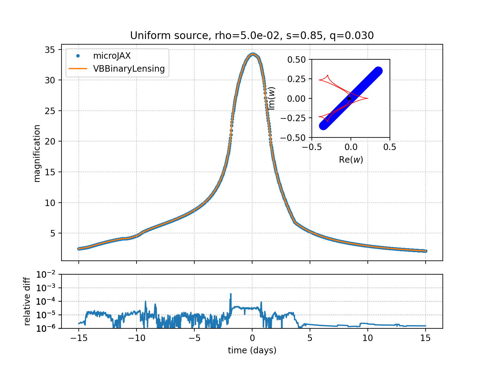
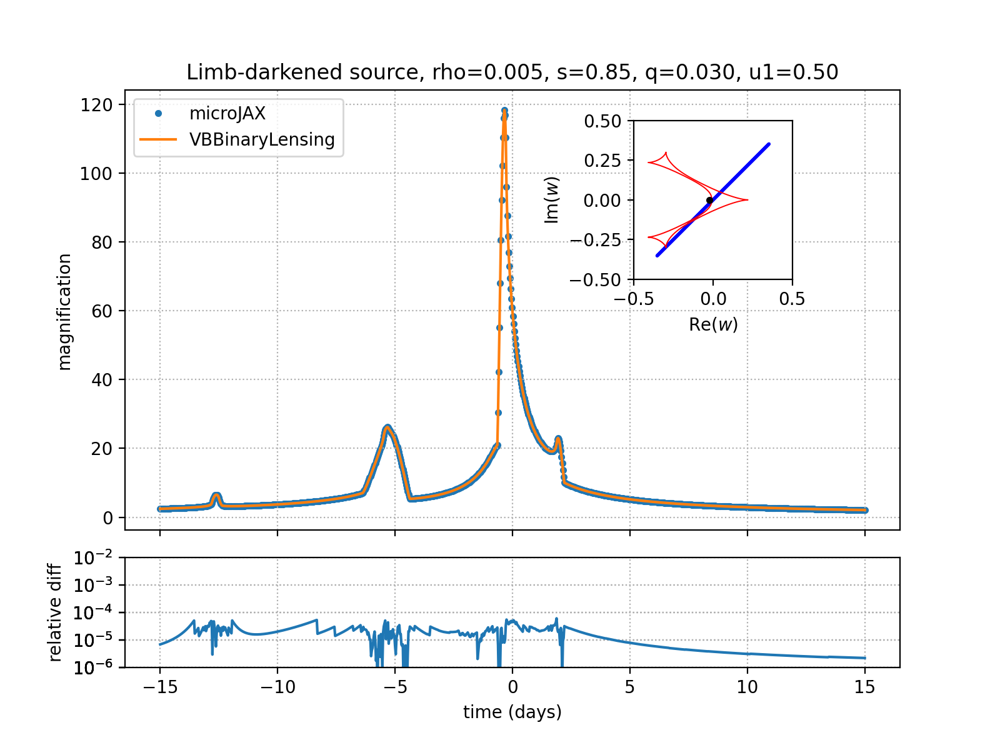

Binary-Lens Benchmarks
======================

Side-by-side comparisons between microJAX and `VBBinaryLensing` for uniform
and limb-darkened binary microlensing light curves.

Contents
--------
- `compare_binary_uniform.py`: tracks a uniform source and measures relative
  accuracy and runtime against `VBBinaryLensing.BinaryMag2`.
- `compare_binary_limb_dark.py`: same setup but with a linear limb-darkening
  coefficient `u1 = 0.5`.
- `plot_boundary_construction.py`: renders the image-plane boundary-root
  construction at the largest relative residual found by either comparison.

The physical and temporal setup is defined near the top of each comparison
script. VBBinaryLensing uses the same lens, source, and trajectory parameters
as microJAX in each run.

How to run
----------
1. Install the optional dependency::

       pip install VBBinaryLensing

2. Execute either script with `python`. The programs JIT-compile the
   microJAX solvers, evaluate the light curve, and export a comparison plot
   (`compare_binary_*.png`). Each script also exports
   `compare_binary_*_max_residual_icrs.png` and a same-stem JSON summary for
   the automatically selected maximum-residual time sample.

Both scripts assume double-precision JAX. GPU acceleration is helpful but not
required.

The scripts print median timings after the initial JAX compilation has
completed. A representative CUDA run gave:

```text
python example/compare-binary-vbbl/compare_binary_uniform.py
  number of data points: 1000
  computation time: 0.001 sec (0.001 ms per point) for point-source in microJAX
  computation time: 0.090 sec (0.090 ms per point) for hexadecapole in microJAX
  computation time: 0.745 sec (0.745 ms per point) with VBBinaryLensing
  computation time: 0.219 sec (0.219 ms per point), median of 7, with microJAX mag_binary, n_limb=500
  relative difference vs VBBinaryLensing: median=1.150e-06, p95=7.210e-06, max=2.452e-05
  output: example/compare-binary-vbbl/compare_binary_uniform.png

python example/compare-binary-vbbl/compare_binary_limb_dark.py
  number of data points: 1000
  computation time: 0.002 sec (0.002 ms per point) for point-source in microJAX
  computation time: 0.093 sec (0.093 ms per point) for hexadecapole in microJAX
  computation time: 1.319 sec (1.319 ms per point) with VBBinaryLensing
  computation time: 0.230 sec (0.230 ms per point), median of 7, with microJAX mag_binary, n_limb=500
  relative difference vs VBBinaryLensing: median=1.265e-05, p95=4.084e-05, max=6.440e-05
  output: example/compare-binary-vbbl/compare_binary_limb_dark.png
```

<table>
  <tr>
    <td style="text-align:center;">
      <figcaption>Uniform source</figcaption>
      
    </td>
    <td style="text-align:center;">
      <figcaption>Limb-darkened source</figcaption>
      
    </td>
  </tr>
</table>
