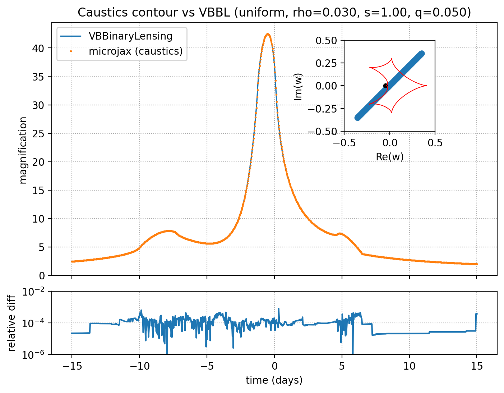
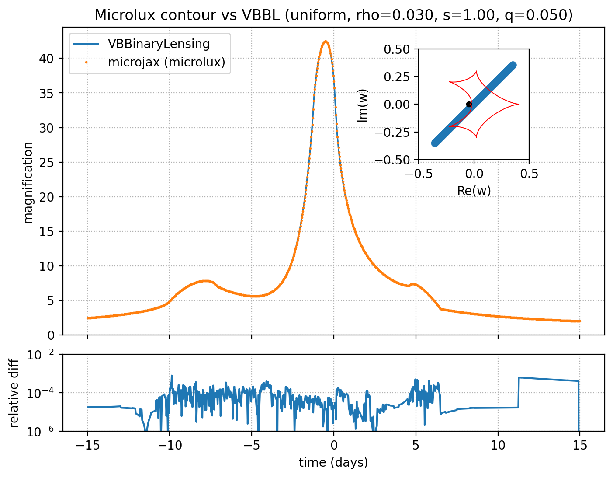
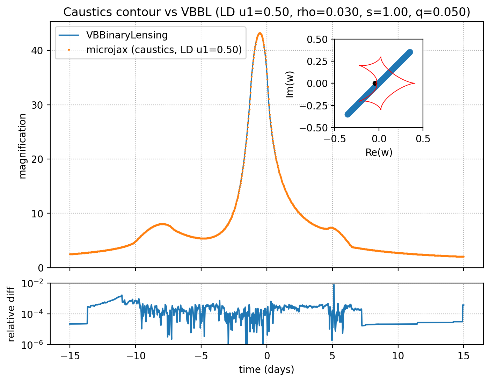
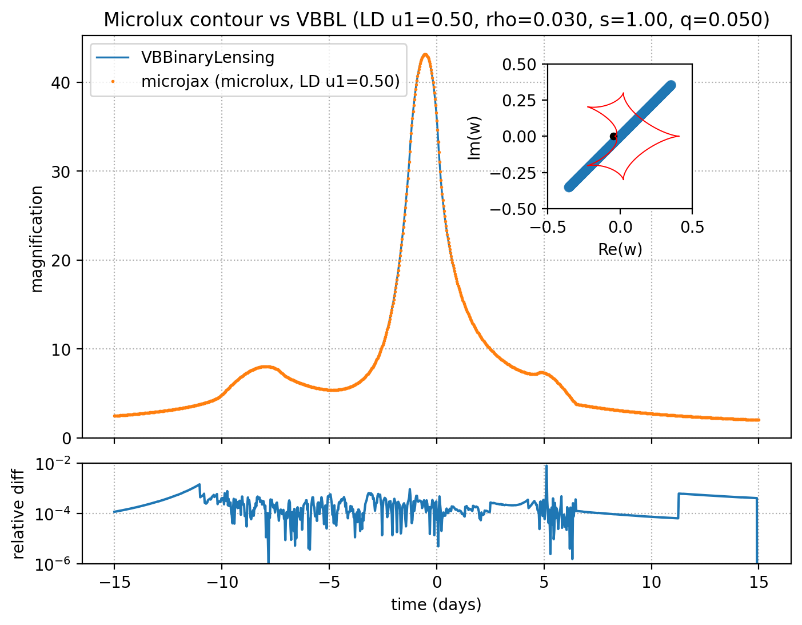

Caustics Contour Test
=====================

This folder contains two scripts that compute the same 1000-point binary-lens
finite-source light curve and compare against VBBinaryLensing. They differ only
in the microjax backend: the caustics integrator versus the microlux-based
contour integrator. Each script now produces two plots per run:
- uniform source
- limb-darkened source with `u1 = 0.5`

Shared model and trajectory
---------------------------
- `q = 0.05`, `s = 1.0`, `t_E = 30.0`, `t_0 = 0.0`, `u_0 = 0.0`, `rho = 0.03`
- `alpha = 45 deg` (`compare_vbbl.py` stores radians as `alpha`,
  `compare_vbbl_microlux.py` stores degrees as `alpha_deg`)
- `num_points = 1000`, time grid spans `[-0.5 * t_E, 0.5 * t_E]`

Trajectory (center-of-mass frame used by both scripts):
```python
tau = (t - t_0) / t_E
y1 = -u_0 * sin(alpha) + tau * cos(alpha)
y2 =  u_0 * cos(alpha) + tau * sin(alpha)
w_points = (y1 + 1j * y2).astype(complex128)
```

Both scripts:
- set `jax_platform_name = cpu` and enable `jax_enable_x64`
- run two JIT warm-ups (uniform + limb-darkening), then time both evaluations
- call `VBBinaryLensing.BinaryMag2(s, q, Re(w), Im(w), rho)` twice:
  `a1 = 0.0` (uniform) and `a1 = 0.5` (limb-darkening)
- generate a two-panel plot (magnification + relative difference) and an inset
  with caustics and the trajectory using
  `critical_and_caustic_curves(nlenses=2, npts=200, s=s, q=q)`
- draw the source trajectory and finite-source discs (radius `rho`) on the inset

Caustics backend: `compare_vbbl.py`
----------------------------------
- microjax calls:
  `microjax.caustics.lightcurve.magnifications(w_points, rho, nlenses=2,
  npts_limb=200, limb_darkening=False, s=s, q=q)`
  `microjax.caustics.lightcurve.magnifications(w_points, rho, nlenses=2,
  npts_limb=200, limb_darkening=True, u1=0.5, npts_ld=100, s=s, q=q)`
- outputs:
  `example/contour_integrating/compare_binary_uniform.png`
  `example/contour_integrating/compare_binary_ld.png`

Microlux backend: `compare_vbbl_microlux.py`
--------------------------------------------
- environment: `JAX_PLATFORMS=cpu`, `XLA_PYTHON_CLIENT_PREALLOCATE=false` are set
  before importing JAX
- microjax calls:
  `microjax.contour.mag_binary(w_points, rho, s=s, q=q, tol=1e-2, retol=1e-3,
  analytic=True)`
  `microjax.contour.mag_binary(w_points, rho, s=s, q=q, tol=1e-2, retol=1e-3,
  analytic=True, limb_darkening_coeff=0.5, n_annuli=10)`
- outputs:
  `example/contour_integrating/compare_binary_uniform_microlux.png`
  `example/contour_integrating/compare_binary_ld_microlux.png`

Results (Side-by-side)
----------------------
Uniform source:
| Caustics backend | Microlux backend |
| --- | --- |
|  |  |

Limb-darkened source (`u1 = 0.5`):
| Caustics backend | Microlux backend |
| --- | --- |
|  |  |

Performance (CPU timings)
-------------------------
Benchmarks below come from runs on Apple M2 (8-core: 4P+4E), 24 GB RAM,
with `py311`, 1000 points:

| Script | Backend | Case | microjax total | microjax ms/pt | VBBinaryLensing total | VBBL ms/pt |
| --- | --- | --- | --- | --- | --- | --- |
| `compare_vbbl.py` | Caustics integrator | Uniform | 3.636 s | 3.636 | 0.290 s | 0.290 |
| `compare_vbbl.py` | Caustics integrator | LD (u1=0.50) | 6.138 s | 6.138 | 0.632 s | 0.632 |
| `compare_vbbl_microlux.py` | Microlux contour integrator | Uniform | 0.793 s | 0.793 | 0.279 s | 0.279 |
| `compare_vbbl_microlux.py` | Microlux contour integrator | LD (u1=0.50) | 6.132 s | 6.132 | 0.632 s | 0.632 |

Usage
-----
1. Install the reference solver: `pip install VBBinaryLensing`
2. Run: `python compare_vbbl.py`
3. Run: `python compare_vbbl_microlux.py`

Notes
-----
- If you see Matplotlib cache warnings, set `MPLCONFIGDIR` to a writable
  directory.
- If microlux prints "No enough space to insert new samplings", increase
  `default_strategy` or relax `tol/retol` in `compare_vbbl_microlux.py`.
