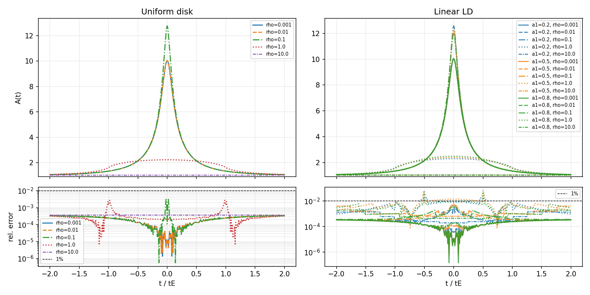

# FSPL FFT vs VBBL comparison (JAX)

Minimal example to benchmark the JAX FFT‑based finite‐source point‑lens (FSPL)
implementation (`microjax.fastlens.fspl_*`) against **VBBinaryLensing** (VBBL).
It produces a residual plot for a grid of source sizes and impact parameters.

## Requirements

- `microjax` (this repo, editable install recommended)
- `VBBinaryLensing` (`pip install VBBinaryLensing`)
- `matplotlib`
- `jax`, `jaxlib` (CPU is fine)

## How to run

You can run it from anywhere (no need to `cd`):

```bash
python example/fspl_fft/compare_fspl_vbbl.py
```

This generates `fspl_vs_vbbl.png` alongside the script. If VBBL is not
installed, the script will print a short message and exit cleanly. JAX is
forced to CPU for consistent timing output; per-ρ timings and speed ratios vs.
VBBL are printed in milliseconds.

## What it does

- Compares **uniform disk** and **linear limb‑darkening** (`a1=0.2,0.5,0.8`).
- ρ grid: `1e-3, 1e-2, 1e-1, 1.0, 10.0`
- Time grid: `t/tE` in `[-2, 2]` (401 points), u(t)=sqrt(u0^2 + (t/tE)^2), u0=0.1
- Uses default FSPL settings (`N_fft=2048`, `fft_logumin=-6`, `fft_logumax=3`).
- Plots A(t) (top) and relative residuals (bottom, log scale); 1% line shown.
- Logs per-ρ runtimes (ms) for VBBL and FSPL and their ratios.

## Sample output


