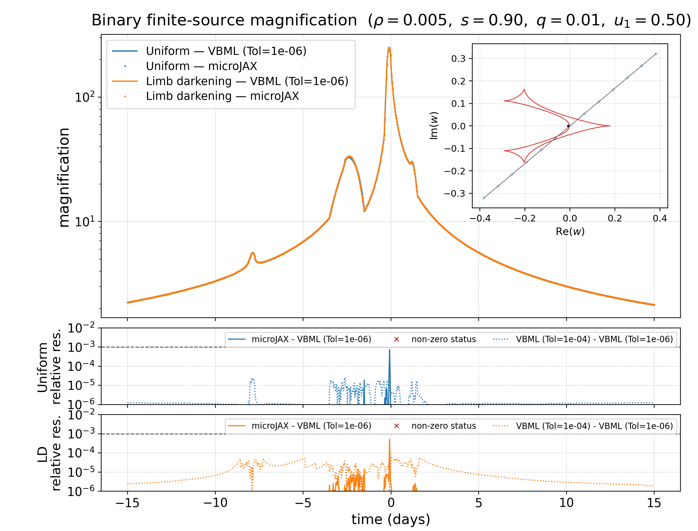

# GPU Binary-Lens Benchmarks

GPU counterpart of `example/cpu/compare-binary-vbml`. One script compares
microJAX with VBMicrolensing (VBML) for uniform and linearly limb-darkened
sources on the same 1,000-point binary-lens trajectory.

The Python sources live in `code/`; generated files are written to `outputs/`.

## Install

```bash
python -m pip install VBMicrolensing matplotlib
```

## Run

```bash
python example/gpu/compare-binary-vbml/code/compare_binary_profiles.py
```

The script warms each JAX solver before recording repeated steady-state GPU
execution. Its CLI and combined figure follow the CPU comparison.

Generated files are:

- `outputs/compare_binary_uniform_limb_dark.png`
- `outputs/compare_binary_profiles_<profile>_max_residual_icrs.png`
- `outputs/compare_binary_profiles_<profile>_max_residual_icrs.json`
- `outputs/benchmark_binary_profiles.json`

The combined figure contains both microJAX and VBML light curves, separate
profile residual panels, and the source trajectory around the caustic.
The maximum-residual products show the accelerator boundary-root construction
for the automatically selected sample.

For VBMicrolensing 5.5, the linear coefficient is assigned to `solver.a1` and
`BinaryMag2` performs the finite-source dispatch. The sixth argument of the
bound `BinaryMagDark` function is a tolerance in the bundled C++ source,
despite being documented as `a1` in its Python docstring.

Timings exclude initial JIT compilation and are hardware dependent. Accuracy
statistics describe only the checked-in trajectories and numerical settings;
they are not general error guarantees.


