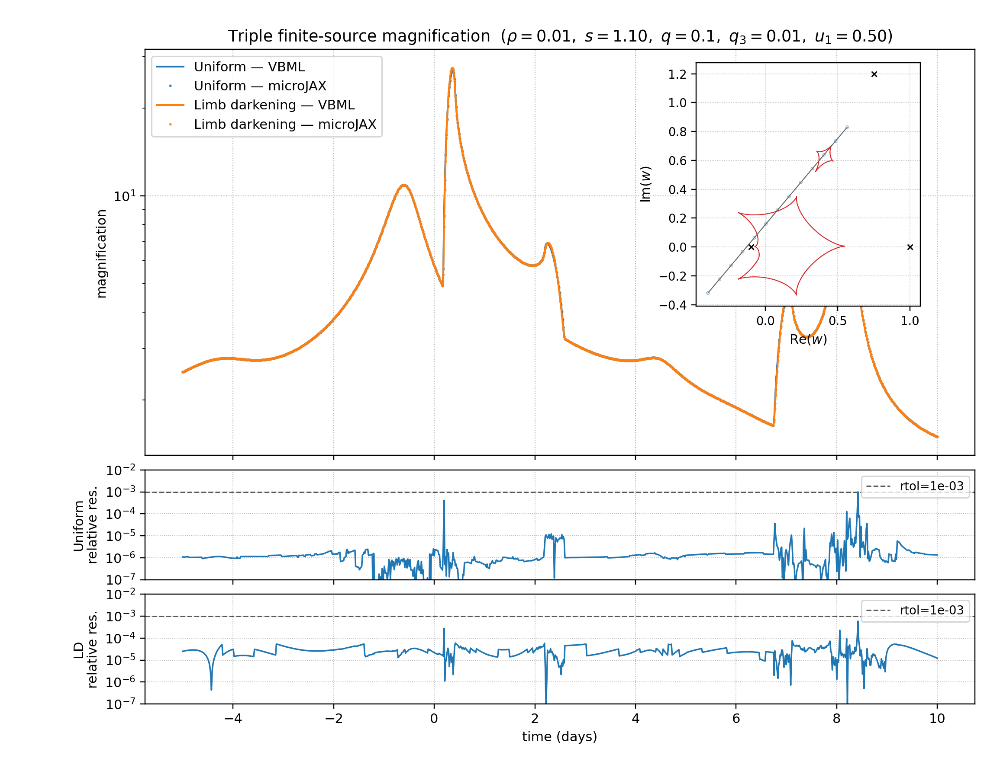

# Triple-Lens Benchmark Against VBMicrolensing

This example compares the finite-source triple-lens magnification from
`microjax.inverse_ray.mag_triple` with `VBMicrolensing.MultiMag2` (uniform
source) and `VBMicrolensing.MultiMagDark` (linear limb darkening). Both source
profiles are evaluated by one script and shown in one comparison figure.

As in the CPU comparison examples, Python sources live in `code/` and
generated files are written to `outputs/`.

The lens has mass ratios `1:q:q3 = 1:0.1:0.01`. The first two lenses have
separation `s = 1.1`; the third is at `0.3 + 1.2i` in their midpoint frame.
Both solvers receive source coordinates relative to the centre of mass of the
first two lenses. The comparison explicitly translates the lens positions
passed to VBMicrolensing so that its coordinate system matches microJAX.

## Install

From the repository environment:

```bash
python -m pip install VBMicrolensing==5.5 matplotlib
```

VBMicrolensing is an optional benchmark dependency and is not imported by the
microJAX package itself.

## Run

```bash
python example/gpu/compare-triple-vbml/code/compare_triple_profiles.py
```

For a short CPU smoke run:

```bash
python example/gpu/compare-triple-vbml/code/compare_triple_profiles.py --quick
```

The script separates JAX compilation from repeated execution and reports the
median execution time of each solver. It writes:

- `outputs/compare_triple_uniform_limb_dark.png`: both light curves, separate
  residual panels, caustics, lens positions, and the source trajectory;
- `outputs/benchmark_triple_profiles.json`: versions, parameters, timings, and
  per-profile error statistics;
- `outputs/compare_triple_profiles_<profile>_max_residual_icrs.{png,json}`: image-plane
  boundary roots, radial integration cells, and metadata at the largest
  pointwise discrepancy. The diagnostic defaults to 80 source-limb samples
  independently of the 128-sample comparison solver, avoiding excessive
  triple-root tracking memory while retaining an interpretable geometry plot.

A representative 1000-point CUDA run prints:

```text
Uniform
VBMicrolensing: 1.207 s (1.207 ms/point); microJAX GPU: 0.941 s (0.941 ms/point); GPU/VBML: 0.78x
relative error: median=1.132e-06, p95=5.939e-06, p99=2.657e-05, max=9.903e-04; nonfinite=0; above rtol=0

Limb darkening
VBMicrolensing: 10.892 s (10.892 ms/point); microJAX GPU: 0.979 s (0.979 ms/point); GPU/VBML: 0.09x
relative error: median=2.533e-05, p95=4.899e-05, p99=5.788e-05, max=5.919e-04; nonfinite=0; above rtol=0
```

These values were measured on the available A100 with 1000 points and the
public triple-GPU default `n_limb=128`. Timings are hardware-dependent. The
error statistics describe the checked-in trajectory and numerical settings,
not a general accuracy bound.



`VBMicrolensing` is LGPL-3.0 licensed and is only an external runtime
dependency of this example. Scientific use of its multiple-lens solver should
cite Bozza et al., *A&A* **694**, A219 (2025), in addition to the references
requested by the upstream project.
