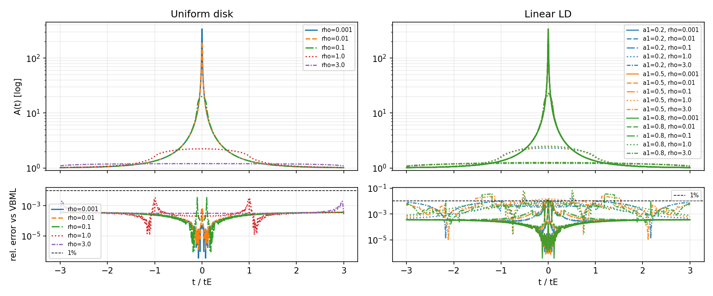

# FSPL FFT vs VBML comparison (JAX)

Minimal example to benchmark the JAX FFT‑based finite‐source point‑lens (FSPL)
implementation (`microjax.fspl.fspl_*`) against **VBMicrolensing** (VBML).
It produces magnification curves and relative residuals along a Paczynski track
for a grid of source sizes.

The Python source lives in `code/`; generated files are written to `outputs/`.

## Requirements

- `microjax` (this repo, editable install recommended)
- `VBMicrolensing` (`pip install VBMicrolensing`)
- `matplotlib`
- `jax`, `jaxlib` (CPU is fine)

## How to run

You can run it from anywhere (no need to `cd`):

```bash
python example/gpu/fspl_fft/code/compare_fspl_vbml.py
```

This generates `outputs/fspl_vs_vbml.png`.
If VBML is not installed, the script will print a short message and exit cleanly. JAX is
forced to CPU for consistent timing output; per-ρ timings and speed ratios vs.
VBML are printed in milliseconds.

## What it does

- Compares **uniform disk** and **linear limb‑darkening** (`a1=0.2,0.5,0.8`).
- ρ grid: `1e-3, 1e-2, 1e-1, 1.0, 3.0` (default; editable at top of script)
- Time grid: `t/tE` in `[-3, 3]` with 1000 points, u(t)=sqrt(u0^2 + (t/tE)^2), default `u0=0.0` (set >0 to avoid u=0 if desired)
- Plots A(t) (top, log y) and relative residuals vs VBML (bottom, log y); 1% line shown.
- Logs per-ρ runtimes (ms) for VBML and FSPL and their ratios.

## Sample output


