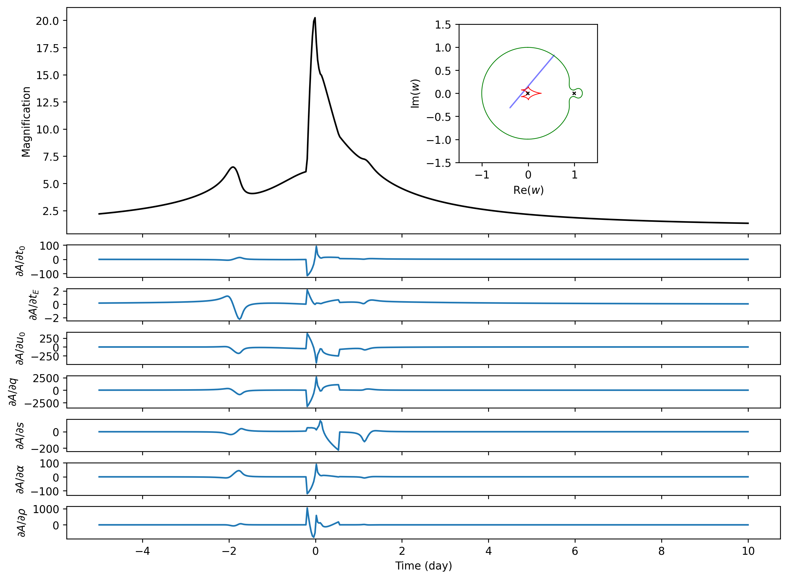
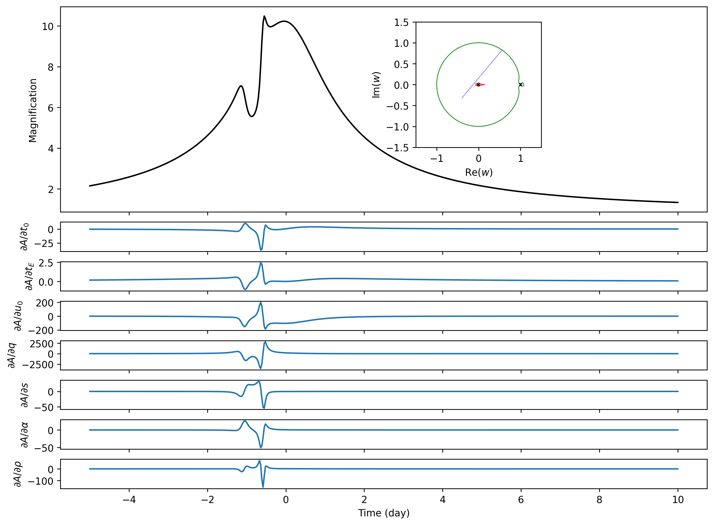

Binary-lens Jacobian Example
============================

This directory is the binary-lens counterpart of
[`example/gpu/jacobian-triple`](../jacobian-triple). It uses the new
[`microjax.inverse_ray.mag_binary`](../../../src/microjax/inverse_ray/lightcurve.py)
function to compute uniform-source magnification and its derivatives with
respect to `t0, tE, u0, q, s, alpha, rho`. In this document, “Jacobian” means
the array containing the derivative of every light-curve point with respect to
each of those seven parameters.

Python sources live in `code/`. Generated products are separated into
`outputs/uniform/` and `outputs/limb_dark/`.

The scripts measure the function value and forward Jacobian after JIT
compilation. The example intentionally contains only the production
forward-mode calculation.

The companion `grads_limb_dark_binary.py` runs the same seven-parameter
Jacobian for a linearly limb-darkened source. Its coefficient is fixed with
`--u1` (default `0.5`) and is not treated as a differentiated parameter in
this example. The reported Jacobian therefore uses the same seven physical and
trajectory parameters as the uniform-source example.

Run
---

The default uses 500 trajectory points and the audited public binary-GPU
default `n_limb=64`. A CUDA-enabled JAX installation is strongly recommended:

```console
XLA_PYTHON_CLIENT_MEM_FRACTION=0.95 \
  python example/gpu/jacobian-binary/code/grads_uniform_binary.py --no-plot
```

For the limb-darkened version:

```console
XLA_PYTHON_CLIENT_MEM_FRACTION=0.95 \
  python example/gpu/jacobian-binary/code/grads_limb_dark_binary.py \
  --u1 0.5 --no-plot
```

The two profiles write to separate output subdirectories and do not overwrite
one another.

To run a small CPU-friendly benchmark and generate both plots:

```console
python example/gpu/jacobian-binary/code/grads_uniform_binary.py --quick
```

The corresponding limb-darkened CPU smoke run is:

```console
python example/gpu/jacobian-binary/code/grads_limb_dark_binary.py --quick
```

The first call of each AD mode includes tracing and JIT compilation. The
reported comparison uses the median of three later, synchronised executions;
change this with `--repeats`.

A100 GPU result
---------------

The bundled products were generated with JAX 0.10.2 on an NVIDIA
A100-PCIE-40GB, with 500 time points and `n_limb=64`:

| computation | compile + first execution | compiled median (3 runs) |
| --- | ---: | ---: |
| uniform magnification | 7.661 s | 0.073 s |
| uniform forward Jacobian | 17.673 s | 0.102 s |

| limb-darkened magnification (`u1=0.5`) | 8.617 s | 0.082 s |
| limb-darkened forward Jacobian | 18.970 s | 0.308 s |

All magnifications and forward derivatives were finite. These timing numbers
apply only to the stated hardware, software versions, trajectory, and source
settings. They are not general performance guarantees. The public
finite-source function also does not provide a guaranteed numerical error
bound, so accuracy should be checked independently for the intended parameter
range.

The CPU Jacobian example currently uses different trajectories and 1000
points, so its checked-in timings are not a direct backend speed ratio.

| Uniform source | Limb-darkened source |
| --- | --- |
|  |  |

Outputs
-------

Each of `outputs/uniform/` and `outputs/limb_dark/` contains:

- `magnification.csv`: time and magnification columns;
- `jacobian_forward.npy`: forward-mode Jacobian (`n_time x 7`);
- `benchmark.json`: configuration, device, warm-up, and compiled timings;
- a magnification and sensitivity figure;
- `ad_benchmark.png`: compile-plus-first and steady-state GPU timings for
  magnification and the forward Jacobian.

All output paths can be redirected with `--output-dir`; use `--no-plot` when
only numerical products and timings are needed.
