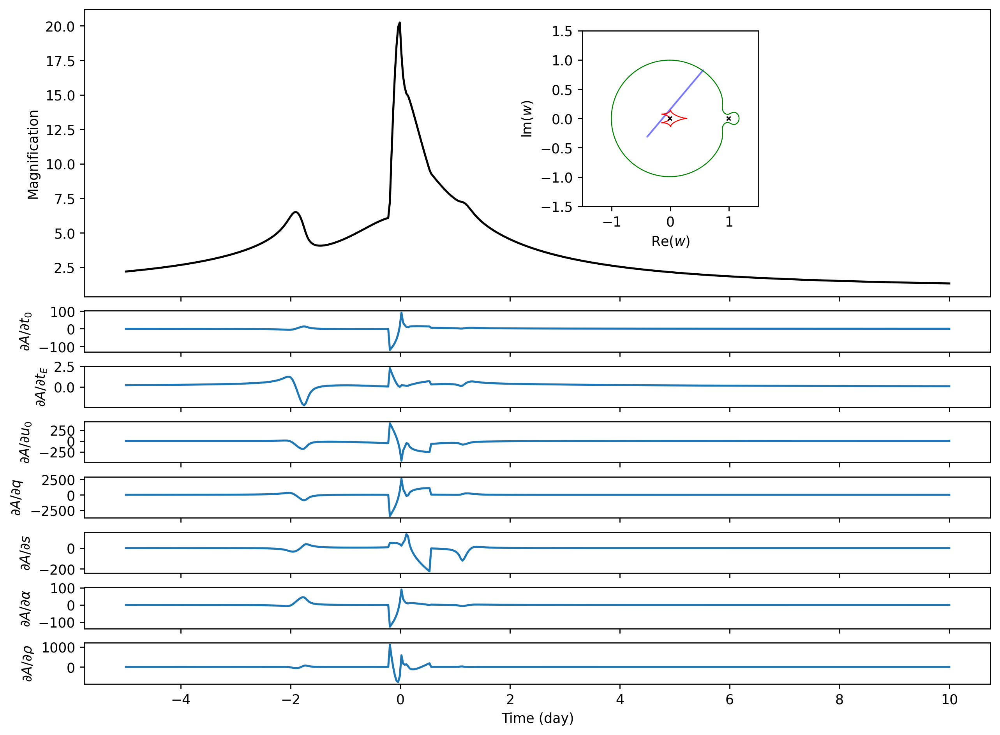

Binary-lens Jacobian Example
============================

This directory is the binary-lens counterpart of
[`example/gpu/jacobian-triple`](../jacobian-triple). It uses the new
[`microjax.inverse_ray.mag_binary`](../../../src/microjax/inverse_ray/lightcurve.py)
function to compute uniform-source magnification and its derivatives with
respect to `t0, tE, u0, q, s, alpha, rho`. In this document, “Jacobian” means
the array containing the derivative of every light-curve point with respect to
each of those seven parameters.

The default path measures the function value and forward Jacobian after JIT
compilation. Because the model has seven inputs and hundreds of outputs,
forward-mode automatic differentiation is the recommended calculation. Pass
`--with-reverse` only to compare it with reverse-mode differentiation;
`--reverse-chunk` then controls how many output derivatives are evaluated
together and therefore changes the memory/performance trade-off.

The companion `grads_limb_dark_binary.py` runs the same seven-parameter
Jacobian for a linearly limb-darkened source. Its coefficient is fixed with
`--u1` (default `0.5`) and is not treated as a differentiated parameter in
this example. The reported Jacobian therefore uses the same seven physical and
trajectory parameters as the uniform-source example.

Run
---

The default uses the same 500-point trajectory and `n_limb=500` as the
triple-lens example. A CUDA-enabled JAX installation is strongly recommended:

```console
XLA_PYTHON_CLIENT_MEM_FRACTION=0.95 \
  python example/gpu/jacobian-binary/grads_uniform_binary.py --no-plot
```

For the limb-darkened version:

```console
XLA_PYTHON_CLIENT_MEM_FRACTION=0.95 \
  python example/gpu/jacobian-binary/grads_limb_dark_binary.py \
  --u1 0.5 --no-plot
```

Its products are written to `limb_dark_outputs/`, so the bundled uniform
products are not overwritten. When `--with-reverse` is requested, the
limb-darkened script uses a smaller default `--reverse-chunk 8` because its
nested profile quadrature is more memory intensive.

The measured reverse-mode run uses about 21.4 GB. On a smaller GPU, reduce
`--reverse-chunk` to lower peak memory.

To run a small CPU-friendly benchmark and generate both plots:

```console
python example/gpu/jacobian-binary/grads_uniform_binary.py --quick
```

The corresponding limb-darkened CPU smoke run is:

```console
python example/gpu/jacobian-binary/grads_limb_dark_binary.py --quick
```

The first call of each AD mode includes tracing and JIT compilation. The
reported comparison uses the median of three later, synchronised executions;
change this with `--repeats`.

A100 GPU result
---------------

The bundled products were generated with JAX 0.10.2 on an NVIDIA
A100-PCIE-40GB, with 500 time points and `n_limb=500`:

| computation | compile + first execution | compiled median (3 runs) |
| --- | ---: | ---: |
| uniform magnification | 11.199 s | 0.108 s |
| uniform forward Jacobian | 20.433 s | 0.151 s |

| limb-darkened magnification (`u1=0.5`) | 11.711 s | 0.114 s |
| limb-darkened forward Jacobian | 21.833 s | 0.389 s |

All magnifications and forward derivatives were finite. Reverse mode remains
available only through the explicit `--with-reverse` comparison. These timing
numbers apply only to the stated hardware, software versions, trajectory, and
source settings. They are not general performance guarantees. The public
finite-source function also does not provide a guaranteed numerical error
bound, so accuracy should be checked independently for the intended parameter
range.

| Magnification and forward Jacobian | Compiled AD runtime |
| --- | --- |
|  |  |

Outputs
-------

- `magnification.csv`: time and magnification columns.
- `jacobian_forward.npy`: forward-mode Jacobian (`n_time x 7`).
- `jacobian_reverse.npy`: optional reverse-mode Jacobian (`n_time x 7`), written
  only with `--with-reverse`.
- `benchmark.json`: configuration, device, warm-up, and compiled timings.
- `binary_jacobian.png`: magnification and sensitivity panels.
- `ad_benchmark.png`: optional forward/reverse compiled-runtime comparison.

All output paths can be redirected with `--output-dir`; use `--no-plot` when
only numerical products and timings are needed.
