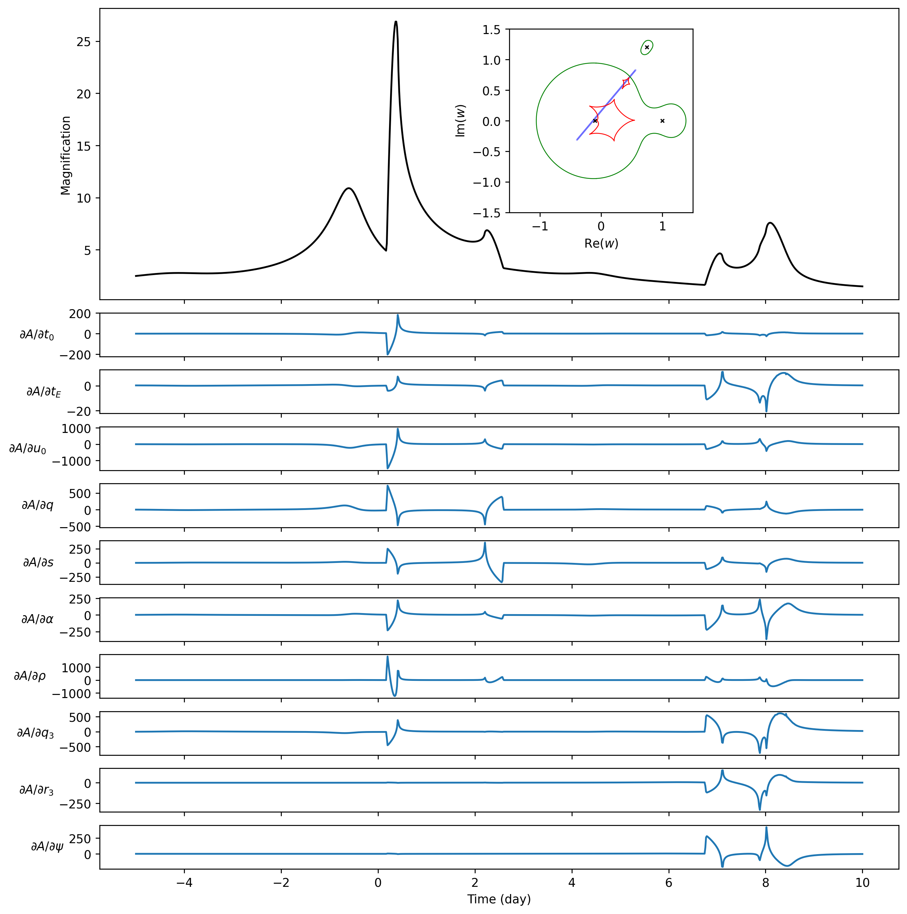
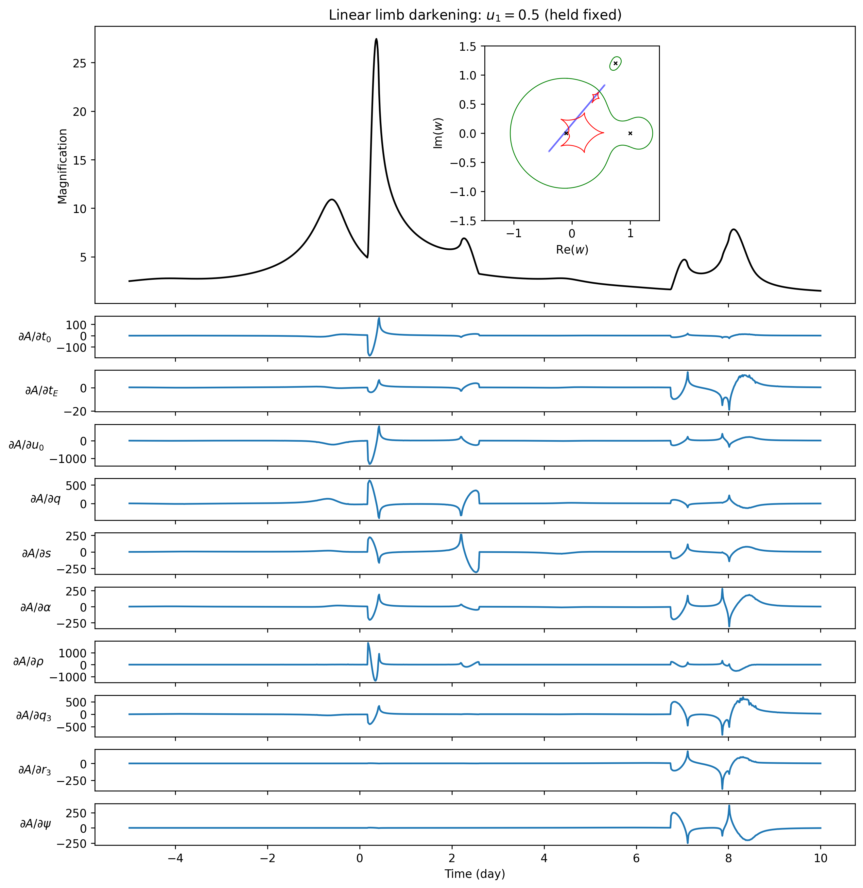

Triple-lens Jacobian Example
============================

This directory is the triple-lens counterpart of
[`example/gpu/jacobian-binary`](../jacobian-binary). The
[`grads_uniform_triple.py`](code/grads_uniform_triple.py) benchmark uses the current
[`microjax.inverse_ray.mag_triple`](../../../src/microjax/inverse_ray/lightcurve.py)
function to compute uniform-source magnification and its forward Jacobian with
respect to `t0, tE, u0, q, s, alpha, rho, q3, r3, psi`. Here “Jacobian” means
the derivative of every light-curve point with respect to each of these ten
parameters.

Python sources live in `code/`. Generated products are separated into
`outputs/uniform/` and `outputs/limb_dark/`.

Like the binary example, it reports JIT warm-up separately from the median of
synchronised compiled executions. The examples contain only forward-mode AD.
The calculation automatically changes its coordinate origin for small isolated
images when that improves their angular resolution; no user setting is required.

Run
---

The default uses 1000 trajectory points and the audited public triple-GPU
default `n_limb=128`. A CUDA-enabled JAX installation is strongly recommended:

```console
XLA_PYTHON_CLIENT_MEM_FRACTION=0.95 \
  python example/gpu/jacobian-triple/code/grads_uniform_triple.py
```

For the limb-darkened version:

```console
XLA_PYTHON_CLIENT_MEM_FRACTION=0.95 \
  python example/gpu/jacobian-triple/code/grads_limb_dark_triple.py --u1 0.5
```

For a smaller GPU smoke run:

```console
python example/gpu/jacobian-triple/code/grads_uniform_triple.py --quick
```

Use `--repeats` to change the number of compiled timing runs,
`--output-dir` to redirect all products, and `--no-plot` when only numerical
products and timings are needed. The workload controls exposed here are
`--n-points` and `--n-limb`. Other numerical and GPU execution choices are
selected automatically by microJAX.

A100 GPU result
---------------

The bundled 1000-point products use JAX 0.10.2 and `n_limb=128`:

| computation | compile + first execution | compiled median (3 runs) |
| --- | ---: | ---: |
| uniform magnification | 10.581 s | 0.941 s |
| uniform forward Jacobian | 21.793 s | 2.212 s |
| limb-darkened magnification (`u1=0.5`) | 11.455 s | 0.980 s |
| limb-darkened forward Jacobian | 25.108 s | 4.001 s |

The benchmark trajectory sends about 89% of its samples to full ICRS, so it
is intentionally a demanding triple-lens workload rather than a fast-path-only
measurement.

Outputs
-------

Each of `outputs/uniform/` and `outputs/limb_dark/` contains:

- `magnification.csv`: time and magnification columns;
- `jacobian_forward.npy`: forward-mode Jacobian (`n_time x 10`);
- `benchmark.json`: configuration, device, warm-up, and compiled timings;
- a magnification, source/lens geometry, and sensitivity figure;
- `ad_benchmark.png`: compile-plus-first and steady-state GPU timings for
  magnification and the forward Jacobian.

| Uniform source | Limb-darkened source |
| --- | --- |
|  |  |
